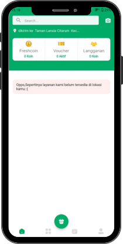
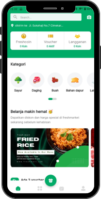

This is a [Next.js](https://nextjs.org/) project bootstrapped with [`create-next-app`](https://github.com/vercel/next.js/tree/canary/packages/create-next-app).

# Freshmarket :  Bringing Freshness to Your Doorstep, Supporting Local Farmers!"

This website is used to participate in the polardb hackthon

<!-- 
 -->

## Description 

The Freshmart start-up brand aims to fulfill the needs of consumers and farmers by offering high-quality food products at affordable prices. Freshmart is expected to help increase Indonesia's food security index, especially in the affordability, quality and safety categories. By buying the best products from local farmers at a fair price, Freshmart hopes to encourage farmers to produce high-quality products, thus increasing Indonesia's food security index.

## Feature
Fresmart main Feature :

### Easy Shopping
In general, Freshmart has basic features found in other e-commerce food applications in Indonesia such as the product purchase feature, promo feature, vouchers, and we have also provided complete digital payment options.

### Chef Ai
This feature allows users to find out various things with the help of AI! You can ask about information on food ingredients that you are looking for, and even search for information on a recipe for a meal. The use of this AI Chef feature is not limited to just that! It can be utilized for much more than that! To better understand.

### Search Product with image

This feature allows users to search for food items based on their name or desired category using image classification. Unlike other e-commerce platforms, with our application, users only need to take or upload a relevant image of the food item they want to search for, and our app will automatically determine what item is being sought by the user. With this feature, users can easily find the desired food item without having to struggle to find out the name of the item first..

### Zofea

This feature allows users to choose the shipping zone for their goods. Users can select the nearest shipping zone to their location, so that the goods shipped can be more guaranteed, efficient, and maintain their quality. By determining your location, Freshmart will determine what food ingredients are available in your area based on the nearest warehouse location in your city!
<!-- 

 -->

## Demo
Check out the live demo of our App <a href="https://freshmartid.shop/"> here</a>

And you can watch our presentation <a href="https://www.youtube.com/watch?v=D4Ud1F5tReQ">here</a>

## Requirements
if you want run in localhost , ensure that you have the following installed on your computer

- Node js
- NPM

